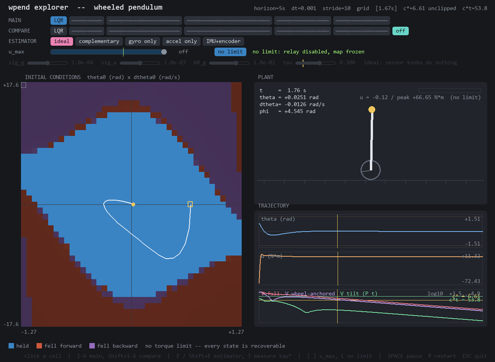
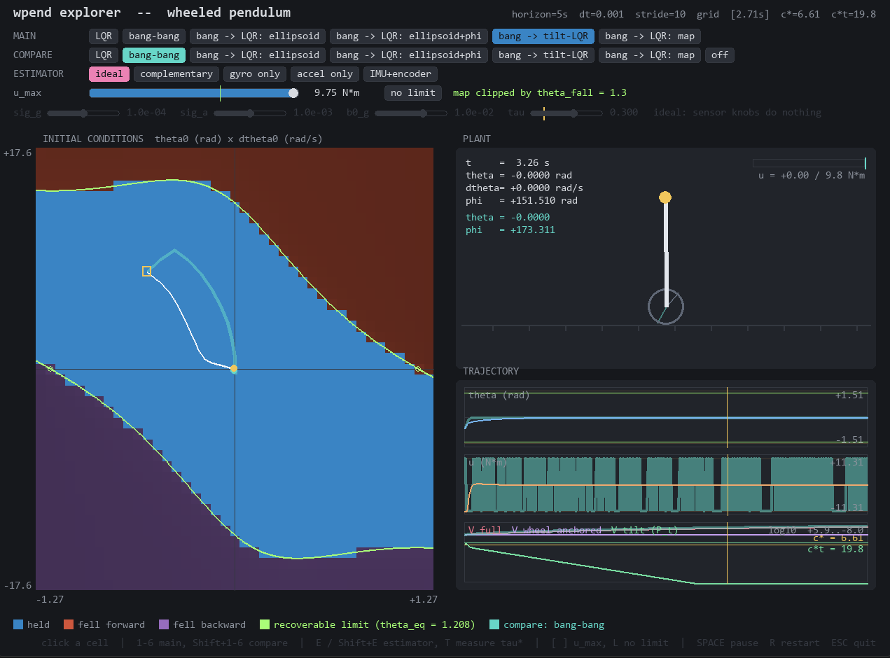

# Линия расхождения
`сделать кнопочку включения\выключения ограничения на управление чтобы понять является ли это причиной расхождения теоретической линии слома и практической`

На картинке сверху виидно, что присутстсвуют зоны, где Controller не работает, но при этом нет ограничений от линии H

# Норма Гессиана
`почему норма гессиана такая большая в области 30 градусов 
в этой области синус почти равен аргументу 
почему система при тета = 0 и тета_дот не равным нулю почти линейна по норме гессиана`

# $\theta_0=\frac{\pi}{2} - \epsilon$
`
а может ли маятник восстановиться из положения тетф0 = pi/2 - eps
проверить отдельно симуляциями и формулами
`

Как будет показано далее стабильность разомкнутого контура зависит только от $\theta$ и $\dot\theta$. У меня получилось стабилизировать чисто $\theta$ с расходящемся $\phi$, для этих целей подходит даже bang-bang.
Граница по $H$, при этом не нарушается в симуляции. 

Возник вопрос, а как это можно проверить формулами? То есть нужно показать, что существует такое управление, которое может вывести систему из того положения и стабилизировать?

# Влияние $\dot\phi$ на стабильность
`
проверить влияет ли фи дот 0 на стабилизизацию вообще (моя интуиция говорит, что да. prove me wrong)
`

В разомкнутой системе $\phi$ и $\dot\phi$ никак не влияют на $\ddot\theta$ и $\ddot\phi$. Это можно показать через Лагранжиан системы, в нём члены с $\dot\phi$ сокращаются.
$$T = \frac{m_w r^2 \dot\phi^2}{2} + \frac{m_b (\dot\phi^2 r^2 + \dot\theta ^2 l^2 cos^2 \theta + 2\dot\phi r \dot\theta l cos \theta)}{2}$$
$$P = m_b g l cos \theta$$
$$L= T-P$$
$$\frac{\partial L}{\partial \dot s} = 
\begin{bmatrix}
m_b \dot\theta l^2 + m_b r l \dot\phi cos \theta \\
(m_w + m_b)\dot\phi r^2 + m_b r l \dot\theta cos \theta
\end{bmatrix}$$

$$\frac{d}{dt}\frac{\partial L}{\partial \dot s} = 
\begin{bmatrix}
m_b \ddot\theta l^2 + m_b r l \ddot\phi cos \theta  - \mathbf{m_b r l \dot\phi\dot\theta sin \theta} \\
(m_w + m_b)\ddot\phi r^2 + m_b r l \ddot\theta cos \theta - m_b r l \dot\theta^2 sin \theta
\end{bmatrix}
$$

$$\frac{\partial L}{\partial s} = 
\begin{bmatrix}
-\mathbf{m_brl\dot\phi\dot\theta sin\theta} + m_b g l sin \theta \\
0
\end{bmatrix}
$$

Однако стабильность замкнутого контура с LQR - уже начинает зависеть от $\dot\phi$, так как добавляется слагаемое зависящее от $\dot\phi$

# Эллипсоид для начальных условий
`
научиться рисовать эллипсоид (максимально большой) лежащий в стабилизируемом множестве для безопасного задания начальных условий по тета, тета дот и фи дот
`

Сам эллипсоид зависит от 

# Симуляция IMU
 `
 засимулировать имушу с слайдером шума и базовых отклонений (погугли как они устроены, эти отклонения\шумы: нормально или ненормально) 
 `

Как я оценивал состояние системы по IMU. Показания аккселерометра - это удельная сила:

$$f = R(\theta)^T · (a − g_{world})$$

Рассмотрим датчик на расстояние $d$ от оси колеса. Для него показания будут следующими:

$$
f_x = −g·sin(\theta) + d·\ddot\theta + r·cos(\theta)·\ddot\phi
$$

$$
f_z =  g·cos(\theta) − d·\dot\theta^2 + r·sin(\theta)·\ddot\phi
$$

Угол можно найти используя:

$$\theta_{acc} = atan2(−f_x, f_z)$$

В покое без шума $\theta_{acc} = \theta$

 # Комплементарный/Аугментированный фильтр
 `
 посмотри что такое аугментированный фильтр 
он похож на экспоненциальное сглаживание, но с добавкой гироскопа к акселерометру 
`

# Фильтр Калмана
`
можешь попробовать калмана 
у нас есть энкодер: посмотреть что с ним, что без него будет
`

# Энергия обратного маятника
`Какой кривой описывается фиксированная энергия вращения обратного маятника`