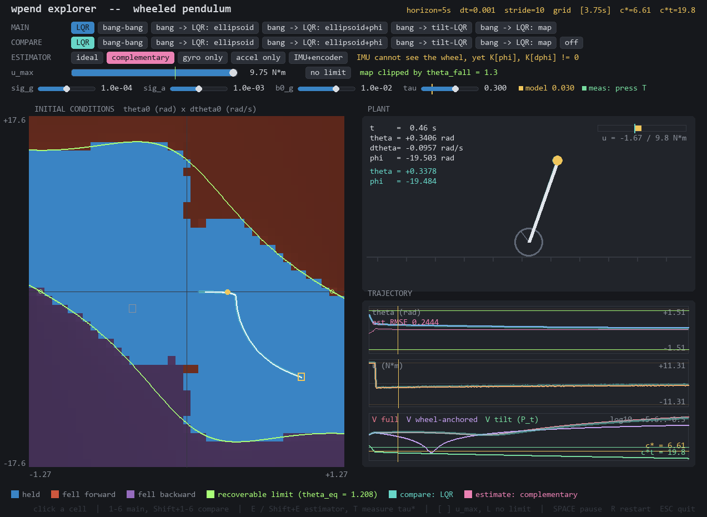
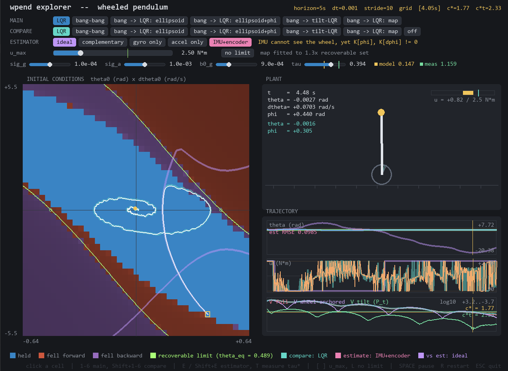

# Линия расхождения
`сделать кнопочку включения\выключения ограничения на управление чтобы понять является ли это причиной расхождения теоретической линии слома и практической`

На картинке сверху виидно, что присутстсвуют зоны, где Controller не работает, но при этом нет ограничений от линии H

# Норма Гессиана
`почему норма гессиана такая большая в области 30 градусов 
в этой области синус почти равен аргументу 
почему система при тета = 0 и тета_дот не равным нулю почти линейна по норме гессиана`

$$
\alpha = I_b + m_b l^2,\qquad
\beta = m_b r l,\qquad
\gamma = I_w + (m_w + m_b) r^2,\qquad
D = m_b g l,
$$

$$
b(\theta) = \gamma + \beta\cos\theta,\qquad
\Delta(\theta) = \alpha\gamma - \beta^2\cos^2\theta > 0,\qquad
\Delta_0 = \Delta(0) = \alpha\gamma - \beta^2.
$$

$$
\boxed{\;\ddot\theta = \frac{b(\theta)\,u + \gamma D\sin\theta - \beta^2\sin\theta\cos\theta\,\dot\theta^2}{\Delta(\theta)}\;}
$$

$$
\boxed{\;\ddot\varphi = \frac{\alpha\beta\sin\theta\,\dot\theta^2 - \beta D\sin\theta\cos\theta - (\alpha+\beta\cos\theta)\,u}{\Delta(\theta)}\;}.
$$

## Структура гессиана: из 64 чисел ненулевых шесть

$$H^{(i)}_{jk} = \frac{\partial^2 f_i}{\partial x_j\,\partial x_k}\Big|_{u\ \text{заморожено}},\qquad x = (\theta,\varphi,\dot\theta,\dot\varphi)$$

Формально это $4\times4\times4 = 64$ числа, но:

* $f_1 = \dot\theta$ и $f_2 = \dot\varphi$ линейны, значит $H^{(1)} = H^{(2)} = 0$;
* $\ddot\theta$ и $\ddot\varphi$ не зависят ни от $\varphi$, ни от $\dot\varphi$, значит строки и столбцы колеса нулевые.

Остаются два симметричных блока $2\times2$ в переменных $(\theta,\dot\theta)$:

$$H^{(i)} = \begin{pmatrix} \partial^2_{\theta\theta} f_i & \partial^2_{\theta\dot\theta} f_i \\[2pt] \partial^2_{\theta\dot\theta} f_i & \partial^2_{\dot\theta\dot\theta} f_i \end{pmatrix},\qquad i \in \{3,4\}$$

то есть шесть различных чисел. **Гессиан по всем четырём переменным ничего не добавляет к гессиану по $(\theta,\dot\theta)$** — нулевые строки колеса полезны ровно один раз, как проверка.

## Полные формулы

Обе правые части имеют вид $f = N(\theta,\dot\theta)/\Delta(\theta)$ с общим знаменателем, поэтому достаточно одного правила частного, применённого дважды. Производные знаменателя:

$$\Delta' = \beta^2\sin 2\theta,\qquad \Delta'' = 2\beta^2\cos 2\theta$$

$$\boxed{\begin{aligned}
\frac{\partial^2 f}{\partial\theta^2} &= \underbrace{\frac{N_{\theta\theta}}{\Delta}}_{\text{числитель}} \;\underbrace{-\;\frac{2N_\theta\Delta' + N\Delta''}{\Delta^2} \;+\; \frac{2N(\Delta')^2}{\Delta^3}}_{\text{знаменатель}} \\[6pt]
\frac{\partial^2 f}{\partial\theta\,\partial\dot\theta} &= \frac{N_{\theta\dot\theta}}{\Delta} - \frac{N_{\dot\theta}\,\Delta'}{\Delta^2}
\qquad\qquad
\frac{\partial^2 f}{\partial\dot\theta^2} = \frac{N_{\dot\theta\dot\theta}}{\Delta}
\end{aligned}}$$

Последние две простые, потому что $\Delta$ от $\dot\theta$ не зависит. Числители и их производные:

| | $\ddot\theta$: $N_3$ | $\ddot\varphi$: $N_4$ |
|---|---|---|
| $N$ | $(\gamma + \beta\cos\theta)u + \gamma D\sin\theta - \tfrac12\beta^2\sin 2\theta\,\dot\theta^2$ | $\alpha\beta\sin\theta\,\dot\theta^2 - \tfrac12\beta D\sin 2\theta - (\alpha + \beta\cos\theta)u$ |
| $N_\theta$ | $-\beta\sin\theta\,u + \gamma D\cos\theta - \beta^2\cos 2\theta\,\dot\theta^2$ | $\alpha\beta\cos\theta\,\dot\theta^2 - \beta D\cos 2\theta + \beta\sin\theta\,u$ |
| $N_{\theta\theta}$ | $-\beta\cos\theta\,u - \gamma D\sin\theta + 2\beta^2\sin 2\theta\,\dot\theta^2$ | $-\alpha\beta\sin\theta\,\dot\theta^2 + 2\beta D\sin 2\theta + \beta\cos\theta\,u$ |
| $N_{\dot\theta}$ | $-\beta^2\sin 2\theta\,\dot\theta$ | $2\alpha\beta\sin\theta\,\dot\theta$ |
| $N_{\theta\dot\theta}$ | $-2\beta^2\cos 2\theta\,\dot\theta$ | $2\alpha\beta\cos\theta\,\dot\theta$ |
| $N_{\dot\theta\dot\theta}$ | $-\beta^2\sin 2\theta$ | $2\alpha\beta\sin\theta$ |

Мастер-формула плюс эта таблица дают все шесть чисел при любых $(\theta,\dot\theta,u)$

### Что сворачивается сразу

$$\frac{\partial^2\ddot\theta}{\partial\dot\theta^2} = -\frac{\beta^2\sin 2\theta}{\Delta},
\qquad
\frac{\partial^2\ddot\varphi}{\partial\dot\theta^2} = \frac{2\alpha\beta\sin\theta}{\Delta}$$

$$\frac{\partial^2\ddot\theta}{\partial\theta\,\partial\dot\theta} = \left[-\frac{2\beta^2\cos 2\theta}{\Delta} + \frac{\beta^4\sin^2 2\theta}{\Delta^2}\right]\dot\theta,
\qquad
\frac{\partial^2\ddot\varphi}{\partial\theta\,\partial\dot\theta} = \left[\frac{2\alpha\beta\cos\theta}{\Delta} - \frac{2\alpha\beta^3\sin\theta\sin 2\theta}{\Delta^2}\right]\dot\theta$$

Обе производные по скорости пропорциональны $\sin\theta$ или $\sin 2\theta$ — **на вертикали они тождественно нули**.

### Кривизна наклона при $u = 0$, $\dot\theta = 0$

Здесь всё сворачивается в одну дробь, причём $\sin\theta$ выносится за скобку:

$$\boxed{\;\frac{\partial^2\ddot\theta}{\partial\theta^2}\bigg|_{u=0,\ \dot\theta=0} = -\,\gamma D\sin\theta\cdot\frac{\alpha^2\gamma^2 + 4\alpha\beta^2\gamma - 5\beta^4 + \bigl(4\beta^4 - 6\alpha\beta^2\gamma\bigr)\sin^2\theta + \beta^4\sin^4\theta}{\Delta^3(\theta)}\;}$$

Постоянный член скобки факторизуется: $\alpha^2\gamma^2 + 4\alpha\beta^2\gamma - 5\beta^4 = (\alpha\gamma + 5\beta^2)(\alpha\gamma - \beta^2)$.

### Норма

$$\lVert H\rVert_F = \sqrt{\sum_{i\in\{3,4\}}\Bigl[\bigl(\partial^2_{\theta\theta}f_i\bigr)^2 + 2\bigl(\partial^2_{\theta\dot\theta}f_i\bigr)^2 + \bigl(\partial^2_{\dot\theta\dot\theta}f_i\bigr)^2\Bigr]}$$

Двойка при смешанном члене — потому что он входит в симметричную матрицу дважды.

# $\theta_0=\frac{\pi}{2} - \epsilon$
`
а может ли маятник восстановиться из положения тетф0 = pi/2 - eps
проверить отдельно симуляциями и формулами
`

Как будет показано далее стабильность разомкнутого контура зависит только от $\theta$ и $\dot\theta$. У меня получилось стабилизировать чисто $\theta$ с расходящемся $\phi$, для этих целей подходит даже bang-bang.
Граница по $H$, при этом не нарушается в симуляции. 

## Возник вопрос, а как это можно проверить формулами? То есть нужно показать, что существует такое управление, которое может вывести систему из того положения и стабилизировать?

# Влияние $\dot\phi$ на стабильность
`
проверить влияет ли фи дот 0 на стабилизизацию вообще (моя интуиция говорит, что да. prove me wrong)
`

В разомкнутой системе $\phi$ и $\dot\phi$ никак не влияют на $\ddot\theta$ и $\ddot\phi$. Это можно показать через Лагранжиан системы, в нём члены с $\dot\phi$ сокращаются.
$$T = \frac{m_w r^2 \dot\phi^2}{2} + \frac{m_b (\dot\phi^2 r^2 + \dot\theta ^2 l^2 cos^2 \theta + 2\dot\phi r \dot\theta l cos \theta)}{2}$$
$$P = m_b g l cos \theta$$
$$L= T-P$$
$$\frac{\partial L}{\partial \dot s} = 
\begin{bmatrix}
m_b \dot\theta l^2 + m_b r l \dot\phi cos \theta \\
(m_w + m_b)\dot\phi r^2 + m_b r l \dot\theta cos \theta
\end{bmatrix}$$

$$\frac{d}{dt}\frac{\partial L}{\partial \dot s} = 
\begin{bmatrix}
m_b \ddot\theta l^2 + m_b r l \ddot\phi cos \theta  - \mathbf{m_b r l \dot\phi\dot\theta sin \theta} \\
(m_w + m_b)\ddot\phi r^2 + m_b r l \ddot\theta cos \theta - m_b r l \dot\theta^2 sin \theta
\end{bmatrix}
$$

$$\frac{\partial L}{\partial s} = 
\begin{bmatrix}
-\mathbf{m_brl\dot\phi\dot\theta sin\theta} + m_b g l sin \theta \\
0
\end{bmatrix}
$$

Однако стабильность замкнутого контура с LQR - уже начинает зависеть от $\dot\phi$, так как добавляется слагаемое зависящее от $\dot\phi$

# Эллипсоид для начальных условий
`
научиться рисовать эллипсоид (максимально большой) лежащий в стабилизируемом множестве для безопасного задания начальных условий по тета, тета дот и фи дот
`

## Надо обсудить

# Симуляция IMU
 `
 засимулировать имушу с слайдером шума и базовых отклонений (погугли как они устроены, эти отклонения\шумы: нормально или ненормально) 
 `

## Оценка состояния системы по показания

### Аккселерометр

Как я оценивал состояние системы по IMU. Показания аккселерометра - это удельная сила:

$$f = R(\theta)^T · (a − g_{world})$$

Рассмотрим датчик на расстояние $d$ от оси колеса. Для него показания будут следующими:

$$
f_x = −g·sin(\theta) + d·\ddot\theta + r·cos(\theta)·\ddot\phi
$$

$$
f_z =  g·cos(\theta) − d·\dot\theta^2 + r·sin(\theta)·\ddot\phi
$$

Угол можно найти используя:

$$\theta_{acc} = atan2(−f_x, f_z)$$

В покое без шума $\theta_{acc} = \theta$

### Гироскоп

Гироскоп измеряет $\dot\theta$ напрямую.

## Добавление шума к показаниям

Зашумление состоит из 2ух основных компонент bias $b(t)$ и отдельно шум $n(t)$:

измеренная величина = истинная + $b(t)$ + $n(t)$,        

$db/dt$ = $−b/\tau$ + $sigma_b·w(t)$

$n(t)$ - это белый шум, он гауссов, независимый по отсчётам

$b(0)$ - смещение включения, гауссов, константа внутри прогона

$b(t)$ - блуждание при $\tau=\infty$, или марковский. Приращения гауссовы, но процесс нестационарен 

Марковский процесс для bias моделируется следующим образом:

$$b_{k+1}=e^{-dt/\tau}b_k+\sigma_{bg}\sqrt{\frac{\tau(1-e^{-2dt/\tau})}{2} w_k}$$

В реальном железе обычно происходит фликкер, а не блуждание. Фликкер - это шум со спектральной плотностью $S(f) \propto 1/fr$. Его дисперсия за время растёт как ~ln(t). Мы же использовали блуждание, так как его проще моделировать, а также оно является консервативной оценкой, имя спектр $S_б(t) \propto 1/fr^2$

## Использованные параметры

| параметр | по умолчанию | единицы | порядок у реального железа |
|---|---|---|---|
| $\sigma_g$ | `1e−4` | рад/с/√Гц | MPU-6050 ≈ `9e−5`; тактический ≈ `2e−5` |
| $\sigma_a$ | `1e−3` | м/с²/√Гц | MPU-6050 ≈ `4e−3`; тактический ≈ `6e−4` |
| $\sigma_{bg}$ | `1e−5` | рад/с²/√Гц | того же порядка |
| $\sigma_{ba}$ | `1e−4` | м/с³/√Гц | того же порядка |
| $b^0_g$ | `1e−2` | рад/с | после грубой калибровки; без неё на порядок хуже |
| $b^0_a$ | `1e−1` | м/с² | даёт ошибку наклона `b0_a/g ≈ 0.01` рад |
| $\tau_g$, $\tau_a$ | `inf` | с | время корреляции ухода смещения у MEMS 10…100 с |
| $d$ | `0.20` | м | вынос датчика от оси колеса |

# Комплементарный/Аугментированный фильтр
 `
 посмотри что такое аугментированный фильтр 
он похож на экспоненциальное сглаживание, но с добавкой гироскопа к акселерометру 
`

$$\hat\theta_{k+1} = a(\hat\theta_{k} + \omega_{k+1}dt) + (1-a)\theta^{acc}_{k}$$

Стоит упомянуть, что помимо IMU, я добавил энкодер, так как из-за независимоти от $\dot\phi$ оценить по-другому это состояние нельзя. Поэтому на фотке сверху $\phi$ вообще не стабилизируется. Интересно, но при некоторых параметрах LQR с фильтром работает лучше, чем LQR, который видит полный state:

# Фильтр Калмана
`
можешь попробовать калмана 
у нас есть энкодер: посмотреть что с ним, что без него будет
`

Пока не трогал

# Энергия обратного маятника
`Какой кривой описывается фиксированная энергия вращения обратного маятника`

$$T+P= \frac{m_w r^2 \dot\phi^2}{2} + \frac{m_b (\dot\phi^2 r^2 + \dot\theta ^2 l^2 cos^2 \theta + 2\dot\phi r \dot\theta l cos \theta)}{2} + m_b g l cos \theta$$