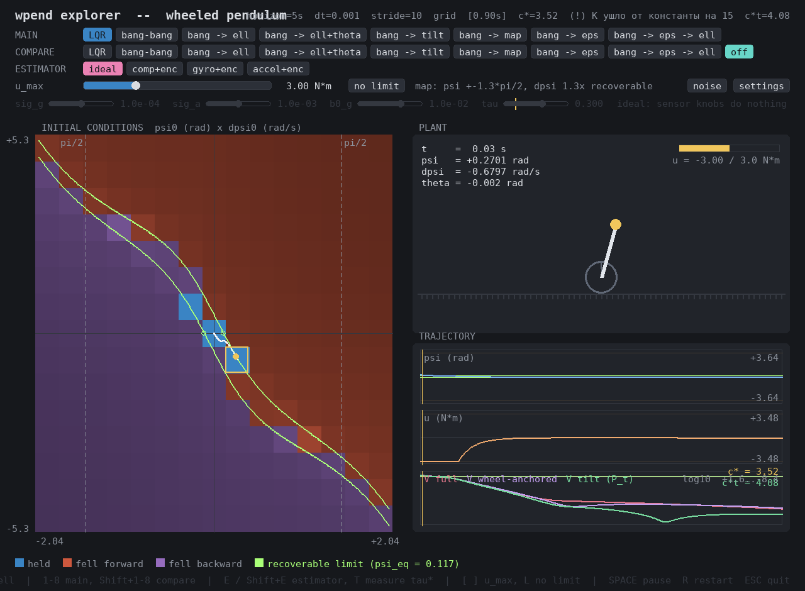

# Смена нотации
`СМЕНИ НОТАЦИЮ`
`пси - наклон`
`тета - колесо`

Сделано. В коде (`wpend/`, `tests/`, `examples/`) и во всех текстовых документах
`docs/` наклон корпуса теперь $\psi$, мировой угол колеса — $\theta$:

$$
x = (\psi,\ \theta,\ \dot\psi,\ \dot\theta),\qquad
\alpha\,\ddot\psi + \beta\cos\psi\,\ddot\theta - D\sin\psi = u,\qquad
\beta\cos\psi\,\ddot\psi + \gamma\,\ddot\theta - \beta\sin\psi\,\dot\psi^2 = -u.
$$

Порядок компонент состояния не менялся: наклон как был `x[..., 0]`, так и
остался, колесо — `x[..., 1]`. Поменялись только буквы, ни одна формула не
тронута.

## Почему это не замена одной буквы

`theta` из проекта не уходит, а меняет смысл на противоположный. Замена
«сначала `phi` → `theta`, потом `theta` → `psi`» схлопнула бы наклон и колесо в
одну переменную: первым проходом колесо стало бы `theta`, вторым уехало бы в
`psi` вместе с настоящим наклоном. Поэтому замена шла через промежуточный
плейсхолдер, которого в коде встретиться не может.

Два места, где механическая замена была бы неправа, и счёт символов этого не
показывает — только чтение:

* `Phi` в `wpend/sensor.py` — **матрица перехода** $\Phi$ дискретного процесса
  смещения ИДУ, $b_k = \Phi b_{k-1} + q_k$, а не угол колеса. Имя оставлено.
* В формулах угол колеса записан как `\varphi`, а внутри этой команды сидит
  подстрока `phi`: наивная замена сделала бы `\vartheta` — команду, рисующую
  совсем другую букву.

## Чем проверено, что ничего не сломалось

Переименование не меняет ни одной формулы, значит все числа обязаны совпасть до
последнего знака.

* **Тесты до и после:** 306 прошли, 9 упали — оба раза, и список проваленных
  совпал дословно. Все девять падали и до замены: это устаревшие эталоны после
  смены параметров модели, к нотации отношения не имеют.
* **Карта исходов и траектории:** прогон окна без экрана, сетка 9×9, для каждого
  регулятора — карта клетка в клетку и хеш всей пачки траекторий. Совпало у 7
  регуляторов из 8. Восьмой (`bang-map`) не проверен: один его прогон не
  укладывается в лимит времени, это единственная дыра в проверке.
* **Старые сохранённые прогоны** (`examples/results/*.npz` от 16.09) читаются
  по-прежнему: имена массивов переводятся при чтении, файлы не переписаны.
  Контрольное число сошлось — базовая цена при 10 Н·м держит 857 клеток из 1033,
  ровно как было записано 16.09.

Подробный отчёт с двумя списками тестов и скриптами замены —
[`21.09-er022-oracle.md`](./21.09-er022-oracle.md).

## Где нотация осталась старой

`src/`, `scripts/`, `main.py` (код второго семестра), картинки `figures/`,
карточки задач `tasks/`, сохранённые прогоны `.npz` и бинарные документы в
`docs/` (`.docx`, `.pdf`, `.ipynb`). Всё, что старше 21.09.2026, читается
по-старому: там наклон — `theta`, колесо — `phi`.

Отдельно стоит помнить про `src/`: там буква `psi` занята и означает **угол
колеса относительно корпуса** — другую величину. От того концепта отказались,
но код и картинки второго семестра переписывать незачем, поэтому одна буква в
двух зонах значит разное. Предупреждение записано в `CLAUDE.md`, чтобы ловушка
не сработала через месяц.
